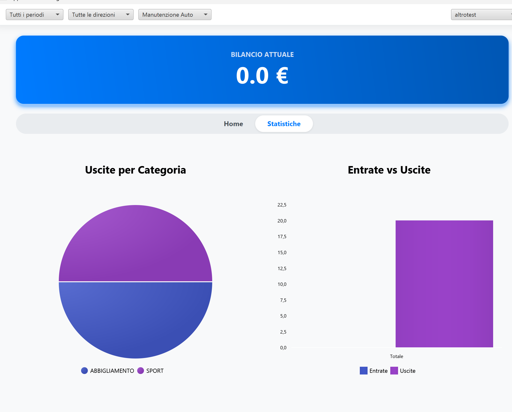
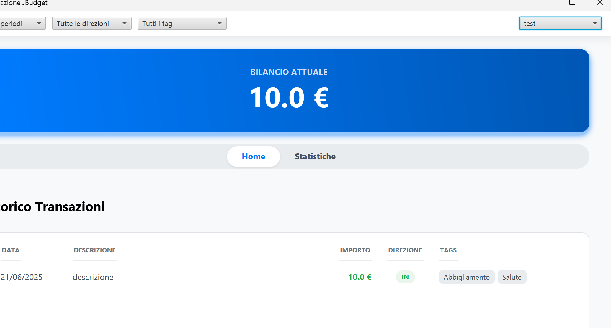
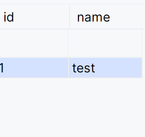
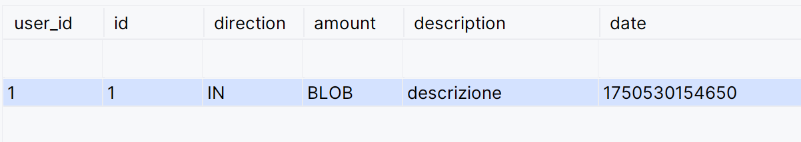
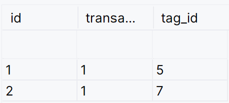

# JBudget - Sistema di Gestione Budget Familiare

## Descrizione del Progetto

JBudget è un'applicazione Java con interfaccia grafica JavaFX progettata per la gestione del budget familiare. Il sistema consente di tracciare movimenti finanziari, categorizzarli tramite tag, pianificare budget e visualizzare statistiche dettagliate. L'architettura modulare garantisce estendibilità e facilita l'integrazione di nuove funzionalità.

## Funzionalità Implementate

### Gestione Movimenti
L'applicazione consente di inserire e consultare movimenti finanziari (entrate/uscite) con associazione di tag per la categorizzazione. Ogni transazione include importo, descrizione, data e direzione. È supportata la gestione di tag multipli per transazione con sistema di priorità.

### Gestione Budget e Bilancio
Il sistema calcola automaticamente il bilancio corrente aggregando tutte le transazioni. Supporta la visualizzazione del saldo per utente specifico o globale, con aggiornamento in tempo reale ad ogni modifica.

### Sistema di Filtri e Visualizzazioni
Implementato un sistema di filtri flessibile per data (giorno, settimana, mese, anno), tag e direzione delle transazioni. I filtri sono combinabili e permettono analisi dettagliate dei dati.

### Statistiche e Analisi
Fornisce grafici a torta e a barre per l'analisi delle spese per categoria e periodo. Include trend temporali e confronti tra diversi intervalli di tempo.


### Gestione Multi-Utente
Supporta la creazione e gestione di utenti multipli con viste separate e aggregate. Ogni utente mantiene le proprie transazioni con possibilità di vista globale.

#### Attenzione: l'utente Global è un aggregatore di utenti, per aggiungere una transazione è necessario avere un utente valido selezionato.
è possibile cambiare utente con il pulsante in alto a destra.


# Responsabilità

## Gestione delle Entità di Dominio
Le entità principali sono rappresentate dalle classi `Transaction`, `User` e `TransactionTag`. La classe `Transaction` gestisce i movimenti finanziari con validazione automatica dei dati e associazione con importi monetari tramite `MoneyAmount`. La classe `User` rappresenta gli utenti del sistema implementando l'interfaccia `View` per il filtraggio e mantenendo una collezione di transazioni. `TransactionTag` gestisce l'associazione many-to-many tra transazioni e tag con supporto per priorità.

## Persistenza e Gestione Dati
La persistenza è gestita attraverso un'architettura ORM basata su ORMLite con database SQLite. La classe `SQLiteDatabase` implementa l'interfaccia `Database` fornendo accesso ai DAO con lazy loading e caching. Il `DatabaseModule` si occupa dell'inizializzazione del database e della registrazione delle entità. La struttura dati garantisce integrità referenziale e supporta transazioni ACID.

## Interfaccia Utente e Presentazione
L'interfaccia grafica è coordinata dalla classe `JBudgetApp` che inizializza l'applicazione JavaFX. Il `ScreenManager` gestisce la navigazione tra le diverse schermate (`HomeScreen`, `StatsScreen`) implementando il pattern Template Method attraverso `AbstractScreen`. I componenti UI (`TransactionGridComponent`, `TransactionDialogComponent`, `BalanceBoxComponent`, `HeaderBarComponent`, `NavigationBarComponent`, `StatsViewComponent`) forniscono il rispettivo builder per costruire i componenti più adatti.

## Logica di Business e Servizi
I servizi di business sono centralizzati nel `ServiceFactory` che implementa il pattern Factory per la gestione delle dipendenze. `TransactionService` e `UserService` gestiscono le operazioni CRUD e la logica di business specifica. `ValidationService` fornisce validazione centralizzata utilizzando Bean Validation, mentre `DialogService` gestisce le interazioni modali con l'utente.

## Sistema di Filtri e Viste
Il sistema di filtri è basato sull'interfaccia `IFilter` con implementazioni specifiche per date `TimeSpan` (`DateFilter`, `AfterDate`, `BeforeDate`) e `Tag` (`NamedTag`, `PriorityTag`). Le classi di filtro supportano la composizione tramite Chain of Responsibility. L'interfaccia `View` definisce il contratto per le viste dei dati con metodi di filtraggio e aggregazione.

## Architettura Modulare
L'applicazione utilizza un'architettura modulare basata sull'interfaccia `Module` gestita dal `ModulesManager`. I moduli principali includono `DatabaseModule` per la persistenza, `JavaFXModule` per l'interfaccia grafica e `GlobalModule` per la configurazione globale. Ogni modulo gestisce il proprio ciclo di vita con metodi di caricamento e scaricamento.

## Gestione Valute e Importi Monetari
La gestione degli importi monetari è affidata alle classi `MoneyAmount`, `Currency` e `ICurrency`. `MoneyAmount` incapsula valore e valuta garantendo integrità e validazione. `BaseCurrency` fornisce implementazioni per valute comuni con supporto per serializzazione e persistenza.
#### Contratti e controllo input
Per la gestione dei contratti e validazione dell'input il programma sfrutta la libreria Jakarta Validation e Hibernate che permettono di definire delle annotazioni per il controllo sugli attributi e variabili e per ciascuno un messaggio di errore comprensibile da inviare all'utente.
```java
...

public class MoneyAmount implements Serializable {

    @Positive(message = "Il valore deve essere positivo.") // controlli sull'input con jakarta validation e hibernate
    @Digits(integer = 20, fraction = 2, message = "Il numero deve avere al massimo 20 cifre intere e 2 decimali.")
    private final Double value;
    
    ...
```


# Avvio del Progetto

Il progetto può essere avviato posizionandosi nella directory principale da terminale ed eseguendo i seguenti comandi:

```bash
gradle build
gradle run
```

L'applicazione richiede Java 21 o superiore e utilizza JavaFX per l'interfaccia grafica. Il database SQLite viene creato automaticamente nel file `database.db` nella directory di lavoro.

## Struttura del Progetto
Il progetto segue la struttura standard Gradle con codice sorgente in `src/main/java` e risorse in `src/main/resources`. Il file `build.gradle` definisce le dipendenze e la configurazione di build.

# Organizzazione dei Dati e Persistenza

## Architettura Database
Il sistema utilizza SQLite come database embedded con ORMLite per il mapping oggetto-relazionale. La struttura include tre tabelle principali:

- **Users**: Gestione utenti con nome univoco
- 
- **Transactions**: Movimenti finanziari con riferimento all'utente
- 
- **TransactionTags**: Associazione many-to-many tra transazioni e tag
- 

## Mapping Entità-Relazioni
Le relazioni sono gestite tramite annotazioni ORMLite con foreign keys e collezioni. `MoneyAmount` è serializzato come BLOB per mantenere l'integrità tra importo e valuta. Le transazioni database garantiscono consistenza dei dati.

## Strategie di Caricamento
Implementato lazy loading per i DAO con caching per ottimizzare le performance. Le TransactionTags utilizzano eager loading per ridurre le query multiple. La gestione delle connessioni è centralizzata con pool di connessioni.

# Meccanismi per Integrare Nuove Funzionalità

## Estensione Modulare
L'architettura modulare permette l'aggiunta di nuovi moduli implementando l'interfaccia `Module`. Ogni modulo gestisce il proprio ciclo di vita e può registrare servizi e componenti. Il `ModulesManager` coordina il caricamento e la gestione delle dipendenze tra moduli.
Sono inoltre disponibili astrazioni come `AbstractModule` e `RequiresModuleManagerModule` per velocizzare l'implementazione

## Sistema di Servizi Estensibile
Il `ServiceFactory` utilizza il pattern Factory per la creazione di servizi con dependency injection. Nuovi servizi possono essere aggiunti estendendo la factory e implementando le interfacce di contratto. La validazione è centralizzata e riutilizzabile.

## Filtri Personalizzati
Il sistema di filtri supporta l'aggiunta di nuovi filtri implementando `IFilter`. I filtri sono componibili tramite Chain of Responsibility e possono essere combinati per creare logiche di filtraggio complesse.

## Componenti UI Riutilizzabili
L'interfaccia grafica utilizza componenti modulari che possono essere estesi o sostituiti. Il pattern Template Method in `AbstractScreen` facilita l'aggiunta di nuove schermate. I componenti UI seguono il pattern Observer per l'aggiornamento automatico dei dati.

## Estensione Entità e Persistenza
Nuove entità possono essere aggiunte annotandole con ORMLite e registrandole nel `DatabaseModule`. Il sistema supporta migrazioni automatiche dello schema e mantiene la compatibilità con versioni precedenti del database.
